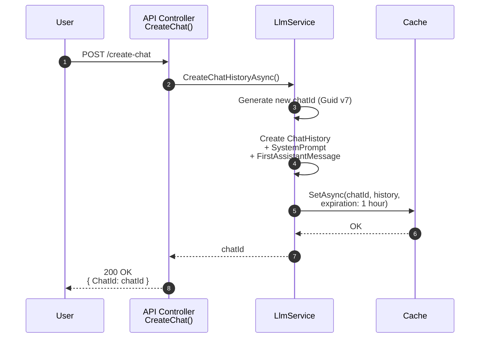
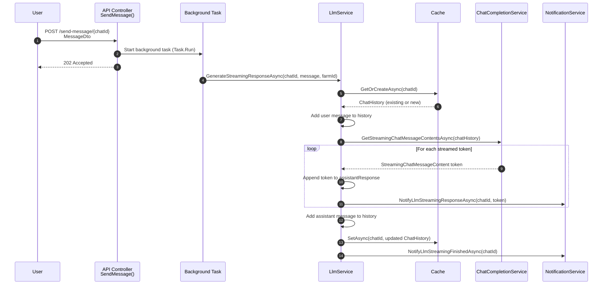

# AgricultureApp

## Introduction

This application was made for farm owners to manage their field cultivations.
Following features are present currently:
- Farm information management,
- Assigning managers to farms,
- Managing fields owned and cultivated by a farm,
- Managing field cultivation information by a farm.

Farm managers can be assigned and removed only by the farm owner. Owners can do
everything managers can, while managers have limited actions. Managers are allowed
to manage the fields farm owns and cultivates, and manage the field cultivation
information. Managers can change the cultivating farm of the field. Cultivating
farm of a field can be assigned by the owning farm, however, reverting this action
can be done by either the owning farm or the farm currently cultivating it.

Each field has cultivations related to it. Only the owner or a manager of the
currently cultivating farm can manage cultivations of the field. This means the
owning farm of the field cannot manage the cultivations until it agains is the
cultivating farm. Each cultivation has the cultivating farm attached with it.

The project structure is created by following Clean Architecture.

If this application was ran in production, it would be done with Containers.
The containerisation is done with Docker Compose and the API and (eventually)
the UI are served with Nginx.

Authentication in the Web API is created with ASP.NET Core Identity and JWT. The JWT setup has support for multiple roles for users. There is a refresh token setup for the tokens. The refresh tokens are currently saved with HybridCache. Every endpoint is
protected by the `Authorize` tag in the API to use the .NET middleware for JWT.

The Web API has localization built in to it. This works via `Microsoft.AspNetCore.Localization` package and `Accept-Language` header in the HTTP request. Localization
is in progress with English (en-GB) and Finnish (fi-FI).

LLM integration is currently done locally with Ollama via Semantic Kernel.
Users can interact with an LLM to ask about farms currently cultivated fields or
a specific field it is cultivating. Information fetching is done with function
calling to enrich the LLM context. Chat history is saved with HybridCache for
one (1) hour at a time from latest message.

## User Secrets / App settings

These are the needed key-value pairs to be set:
```
{
  "Kestrel:Certificates:Development:Password": "<SOME_GUID>",
  "Jwt:Key": "<256_BIT_VALUE>",
  "Jwt:Issuer": "Agriculture App",
  "Jwt:Audience": "Agriculture App",
  "ConnectionStrings:DefaultConnection": "<YOUR_SQL_SERVER_CONNECTION>",
  "LLM": {
    "ModelId": "<YOUR_LLM_ID>,
    "Endpoint": "<LLM_ENDPOINT>"
  }
}
```

## Diagrams

### LLM Usage

#### Chat creation



#### Response generation

